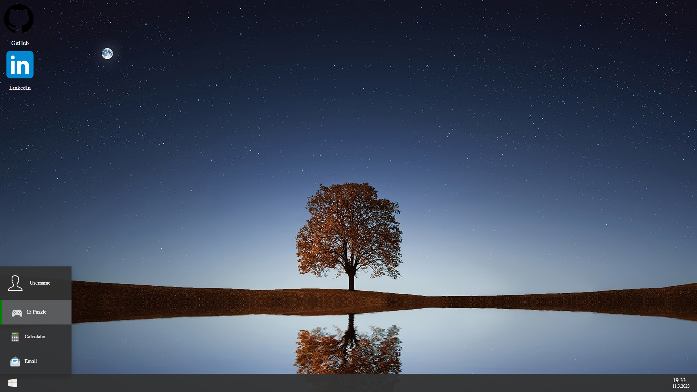

# Portfolio Website

This is my personal portfolio website created using HTML, CSS, and JavaScript (pure if possible). The website is designed to resemble the baby of the Windows 10 and macOS, with icons and applications representing different projects and interests. You can find my socials from the desktop.

# Note

- This project is still in development and some features may be missing or incomplete.
  I'm working on it when I have time, but it's not my main focus at the moment :face_with_spiral_eyes:.
  If you have any questions or feedback, please don't hesitate to contact me.

## Features

- Interactive desktop with clickable icons and menus
- Applications for different projects and interests.
- Responsive design for different screen sizes (soon :D). now best result is with 1,920 x 1,080 pixels

## 15 Puzzle Game

The 15 puzzle game featured on my website is a school project from the first web development class I took at the University of Applied Sciences. It was created using JavaScript and CSS. The game involves sliding tiles around on a board to arrange them in numerical order, and it can be quite challenging!

own repo: [15 puzzle](https://github.com/Wildernessdick/WEB1-15puzzle)

## Code

The website consists of multiple CSS and JavaScript files to help manage and organize the codebase.
Here's an overview of the files:

- `index.html`: The main HTML file for the website.

### CSS

- `site.css` for the website, containing the majority of the website's styles.
- `mail.css` for the "maill form" on the website. Work on progress....
- `navbar.css` for the navigation bar on the bottom of the website.
- `15game.css` for the 15 puzzle game.

### JS

- `site.js`: A JavaScript file containing common logic used throughout the website.
- ~~`mail.js` the logic for the contact form on the website.~~
- `navbar.js` for the navigation bar on the website.
- `15game.js` for the 15 puzzle game on the website.

## Installation

To view the website, simply open the `index.html` file in a web browser.

## Credits

- Background image: [Pexels](https://www.pexels.com/photo/green-tree-268533/)
- Icons: [Icons8](https://icons8.com/)

## Updates

The website will be updated periodically to showcase new projects and skills.

## License

This project is licensed under the MIT License. Feel free to use and modify the website for your own personal use. If you have any questions or feedback, please contact me through the contact me on LinkedIn.
